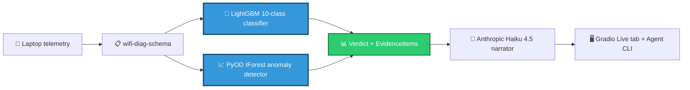

<!-- ABOVE_THE_FOLD_START — DO NOT EDIT WITHOUT UPDATING ALL 3 REPOS (Plan 05-06 byte-equal gate) -->
# AI Internet Diagnostic

> Tells you the *specific* reason your Wi-Fi just dropped — evidence-grounded, confidence-scored attribution like _"your school's 802.1X session expired at 09:14:23 — here are the three telemetry signals that prove it."_

## Results

**Macro F1:** 0.974 (synthetic) · pending (real, Reality Anchor dogfood) · ECE 0.28


## Architecture


<details>
<summary>Mermaid source (renders on GitHub)</summary>



</details>

_Trained models (blue) sit at the visual gravity center of the pipeline. The LLM narrator (green) is downstream — it explains what the classifier and anomaly detector found, with citations to specific telemetry fields. This is **not** a GPT wrapper._

## Try it live

🔗 **[Live demo on Hugging Face Spaces](https://huggingface.co/spaces/WolfDavid/wifi-diag)**

---

<!-- ABOVE_THE_FOLD_END -->

# AI Internet Diagnostic — HF Space

AI-powered diagnostic for enterprise / school / public Wi-Fi disconnects (802.1X, captive-portal, RADIUS-backed networks). Multi-class classifier + time-series anomaly detector + LLM narrator — explicitly not a "GPT wrapper".

**Phase 1 status:** Hello-world Gradio shell. Phase 3 wires the real verdict UI to the trained models from the [Model repo](https://huggingface.co/WolfDavid/ai-internet-diagnostic-model).

## Pin posture (Pitfall 7 mitigation)

The Gradio version is pinned in this README frontmatter (`sdk_version: 6.13.0`) — the SINGLE source of truth. `requirements.txt` does NOT contain a `gradio` line; double-pinning was the prior project's drift incident.

Python is pinned to 3.13 in both this frontmatter and `pyproject.toml`'s `requires-python`.

## Cache regeneration (Anthropic narrator)

The 8 synthetic scenarios ship with pre-generated narrator output cached at `cache/narrations/{slug}.json` (SCEN-02). At demo time, the Synthetic tab loads these JSONs instead of calling the LLM — zero per-visitor Anthropic API spend (D-NARRATOR-05; Pitfall 10 mitigation).

To regenerate via Anthropic Haiku 4.5:

1. Add `ANTHROPIC_API_KEY` as a repository secret: **Settings → Secrets and variables → Actions → New repository secret** (D-NARRATOR-09 — the key never lives on a developer machine).
2. Open **Actions → Regenerate cached narrations → Run workflow** in the GitHub UI.
3. Optionally specify a comma-separated scenario filter (default: `all`).
4. The workflow opens a PR with the regenerated cache diff. Review and merge.

Local bootstrap fallback (no API key required) — produces structurally-identical output via the templated narrator (LLM-05):

```bash
make cache-narrations-templated
```

CI hard-fails (D-NARRATOR-06) if any cached citation breaks against the regenerated telemetry, if the cached `top_class` drifts from the live classifier, or if the headline exceeds 140 chars. The fix is always: run the regen workflow (or the templated bootstrap) and commit the diff.

## License

Apache-2.0.
